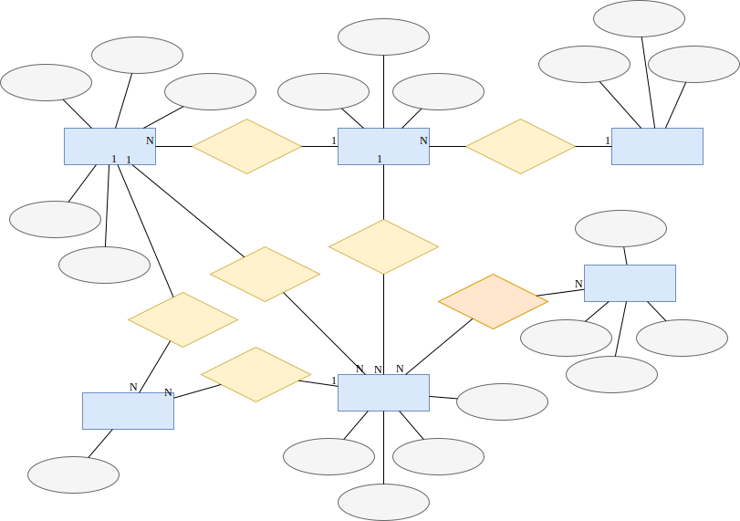

# 数据库设计

## 需求分析

​**信息管理**：项目组队系统主要是完成对学生信息管理、教师信息管理、学生组队管理、项目分发管理、项目匹配管理等。

**注册、登录**：用户可以注册成为学生和教师，通过唯一的用户名来登录。没有教师或同学的用户名是相同的。

​**发布计划、项目**：教师首先面向特定学生发布项目计划（一个项目计划中包括一批不同的项目），教师可对其发布的计划，以及计划中的所有项目进行增删改查等操作。

**组队**：​学生首先按照一定要求进行组队，组队完成后以小组为单位进行项目志愿的填报，学生仅能对项目信息进行查询。

注：在数据库中存储时，学生、教师、项目以及队伍都具有有一个用于索引的 ID 号。

- 教师（Teacher）：教师编号、教师用户名、姓名、电话号码、电子邮箱、密码；
- 学生（Student）：学生编号、学生用户名、姓名、密码、成绩；
- 计划（Plan）：计划编号、计划名称、指导老师、包含项目；
- 项目（Project）：项目编号、项目名称、项目简介、项目的人数要求；
- 小组/小队（Team）：小组编号、小组名称、小组成员、所属项目组、选择的项目；

## 概念设计

在设计项目组对系统数据库时，依据对系统做出的数据和功能的需求分析，确定要存储的有关对象的信息和各个对象的基本属性信息，还需要确定这些对象之间的相互关系。设计出概念模型如下：



## 逻辑结构设计

​逻辑结构设计是根据设计完成的概念模型，按照“实体和联系可以转换成关系”的转换规则，转换生成关系数据库管理系统支持的数据库表的数据结构。然后根据关系数据理论，对关系模式进行优化。根据以上设计的资产管理系统的概念模型和实际应用中的需要，为系统设计出的各数据表的数据结构和完整性约束条件如表所示。

- 教师（Teacher）：教师编号、教师用户名、姓名、电话号码、电子邮箱、密码；
- 学生（Student）：学生编号、学生用户名、姓名、密码、成绩；
- 计划（Plan）：计划编号、计划名称、指导老师、包含项目；
- 项目（Project）：项目编号、项目名称、项目简介、项目的人数要求；
- 小组/小队（Team）：小组编号、小组名称、小组成员、所属项目组、选择的项目；

由于小组志愿数量不定，因此单独设计一个表。

- 小组志愿（Team Wish）：小组编号、选择的项目、优先级

小组和学生是多对多的关系，因此建立“小组成员”表存储所属关系：

- 小组成员（Team Members）：小组编号、学生编号

## 数据定义

定义 Django 中可用的数据模型，即从 `django.db.models.Model` 类继承。

```python
from django.db import models
```

### 教师

定义教师（Teacher）类

```python
class Teacher(models.Model):
    username = models.CharField(max_length=150)
    password = models.CharField(max_length=128)
    name = models.CharField(max_length=150)
    email = models.CharField(max_length=150)
    resume = models.CharField(max_length=150)
```

- `username`：用户名
- `password`：密码
- `name`：教师姓名
- `email`：电子邮箱
- `resume`：教师简历

### 学生

定义学生（Student）类

```python
class Student(models.Model):
    username = models.CharField(max_length=150)
    password = models.CharField(max_length=128)
    name = models.CharField(max_length=150)
    rank = models.IntegerField(default=0)
    email = models.CharField(max_length=150)
    resume = models.CharField(max_length=150)
```

- `username`：用户名
- `password`：密码
- `name`：学生姓名
- `rank`：学生能力等级
- `email`：学生电子邮箱
- `resume`：学生简历

> 事实上可以使用一个用户（User）表记录教师和学生的公共属性，并用另外的表记录身份信息和附加信息。

### 项目计划

项目计划（Plan），也称项目组（Project Group）。项目组仅归属于一位教师。

当项目尚未“过期（expired）”时，学生才能在该项目下组队和选择项目。

```python
class Plan(models.Model):
    teacher = models.ForeignKey(Teacher, on_delete=models.CASCADE)
    name = models.CharField(max_length=150)
    is_expired = models.BooleanField(default=False)
    description = models.CharField(max_length=500)
```

- `teacher`：所属的[教师](#教师)（外键）；当教师被删除时，所有的计划也需要被删除，在 Django 中使用 `on_delete=models.CASCADE` 描述该字段
- `is_expired`：标记项目计划是否“过期”
- `name`：项目计划名称
- `description`：项目计划描述

### 项目

一个项目组下可以包含多个项目。每个项目仅能属于一个项目组。

```python
class Project(models.Model):
    project_group = models.ForeignKey(Plan, on_delete=models.CASCADE)
    name = models.CharField(max_length=150)
    description = models.CharField(max_length=500)
    max_group_num = models.IntegerField(default=5)
    max_team_member_num = models.IntegerField(default=5)
```

- `project_group`：所属的[项目计划](#项目计划)（外键）；当项目计划被删除时，所有的项目也需要被删除，在 Django 中使用 `on_delete=models.CASCADE` 描述该字段
- `name`：项目名称
- `description`：项目描述
<!--
- `max_group_num`：项目中最大组数
- `max_team_member_num`：项目中每组最大人数
-->

### 小组

小组（Group），也称队伍（Team）。一个项目计划下可以有多个小组。一个小组中可以有多个成员。

当项目被删除、或者所属的项目计划被删除时，小组也将被删除。

```python
class Team(models.Model):
    # plan to which this team belong
    project_group = models.ForeignKey(Plan, on_delete=models.CASCADE)
    name = models.CharField(max_length=150)
    # assigned project
    project = models.ForeignKey(Project, on_delete=models.CASCADE)
    members = models.ManyToManyField(Student)
```

- `project_group`：所属的[项目计划](#项目计划)（外键）；当项目计划被删除时，所有的小组也需要被删除，在 Django 中使用 `on_delete=models.CASCADE` 描述该字段
- `name`：小组名称
- `project`：小组所选[项目](#项目)（外键）
- `members`：小组中的[学生](#学生)成员（多对多字段，将被 Django 转化为连接表的形式）

### 小组志愿

```python
class TeamWish(models.Model):
    team = models.ForeignKey(Team, on_delete=models.CASCADE)
    # wished project ...
    project = models.ForeignKey(Project, on_delete=models.CASCADE)
    # ... with priority
    priority = models.IntegerField()
```

- `priority`：志愿优先级
- `project`：小组志愿[项目](#项目)（外键）
- `team`：该条志愿对应的[小组](#小组)（外键）

> 创建数据库的 SQL 语句此处略去。详情可查看 [init.sql](./assets/init.sql)。

## 物理结构设计

### 索引

实际应用时，主要通过 ID 来区分各个用户、项目、项目计划等，因此为这些表上的 ID 列建立索引。

```sql
{{#include assets/init.sql:DB_INDEX}}
```

### 触发器

需要设置触发器的地方为上述设计中标记为“级联删除”的外键字段。

但在 Django 中，其将数据库的中的数据为了 ORM 对象，需要级联删除的操作并非通过触发器实现，而是通过程序代码中的逻辑来进行。

### 角色

类似的，该程序中未在数据库管理系统（DBMS）中建立用户，而是通过判断当前使用程序的用户的身份，在程序逻辑上限制用户的访问。由于用户无法修改 Web 程序背后的逻辑，因此该法仍具有一定的安全性。
