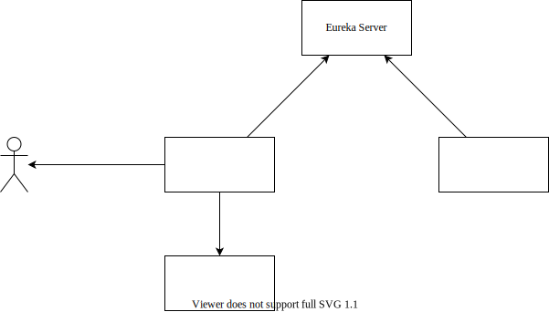

# 分布式架构设计

为了模拟分布式的系统架构，本项目将其中的“分组”功能设计为一个单独的微服务，运行时将自身注册到 Eureka Server。而项目的主业务程序在使用“分组”功能时，向 Eureka Server 请求“分组”功能。

具体实现时，主业务程序将“分组”算法所需的数据从数据库中调出，转换为 JSON 格式，经由 Eureka Server 远程调用运行在另一处的“分组”算法程序；这种方式不需要算法程序拥有自己的数据库，实现了功能的解耦；算法程序运行完成后，同样将数据以 JSON 的格式返回，业务程序收到内容后，解析 JSON 为 Python 的字典格式，并根据数据对自身的数据库进行更新。



Eureka Server 作为注册中心，主业务程序负责提供界面，以及处理和存储用户（学生和教师）上传的数据，而分组算法作为一个单独的微服务发布。

## 具体实现

### Eureka Server

关于启动 Eureka Server 可以参考 [Distributed-System-Course/Eureka-Server - GitHub](https://github.com/Distributed-System-Course/Eureka-Server) 仓库中的代码。启动成功后，Eureka Server 默认运行在 7861 端口，可以被同一网络下的设备访问到。

### 微服务

由于项目使用 Django 框架开发的网站，需要使用 Python 完成服务的订阅与调用。幸运的是，有 [py-eureka-client](https://pypi.org/project/py-eureka-client/) 可以使用。

之后，需要将算法程序设计成一个能够处理 HTTP 请求的微服务，这里同样使用 Django 框架进行开发。通过设计相应的 [URL 映射](https://github.com/Distributed-System-Course/Django-Eureka-Microservice-Demo/blob/feat/grouping/services/urls.py) 之后，[Django 应用程序](https://github.com/Distributed-System-Course/Django-Eureka-Microservice-Demo/blob/feat/grouping/services/views.py) 便能处理 HTTP 请求了。

> 项目代码参见 [Distributed-System-Course/Django-Eureka-Microservice-Demo - GitHub](https://github.com/Distributed-System-Course/Django-Eureka-Microservice-Demo)。

将 `grouping/` 映射到 `grouping` 函数上：

```python
urlpatterns = [
    path('', views.index),
    path('grouping/', views.grouping),
]
```

处理 HTTP 请求的 `grouping` 函数：

```python
def grouping(request):
    data = json.loads(request.body)
    print(data)
    projects = data['projects']
    wishes = data['wishes']
    for wish in wishes:
        for choice in wish['choices']:
            choice = str(choice)
            teams = projects[choice].get('teams', list())
            if len(teams) < projects[choice]['max_group_num']:
                teams.append(wish['team_id'])
                projects[choice]['teams'] = teams
                break
    
    teams = dict()
    for project_id in projects.keys():
        for team in projects[project_id].get('teams', list()):
            teams[team] = project_id
    
    return JsonResponse(teams)
```

之后，假设这个服务所运行在的机器在网络上的 IP 地址为 `10.151.102.74`，端口号为 `8000`，于是将这个注册到 Eureka Server：

假设 Eureka Server 运行在 `http://10.151.102.74:8761`，则使用下边的 Python 代码进行注册：

```python
import py_eureka_client.eureka_client as eureka_client

eureka_client.init(
    # Where the Eureka server is:
    eureka_server="http://10.151.102.74:8761",
    app_name="MyApplication",
    instance_host="10.151.102.74",
    instance_port=8000,
)
```

### 调用服务

上述操作将微服务以 `MyApplication` 的名称注册到了 Eureka Server。之后，需要使用该服务的 Python 程序，在初始化 Eureka Client 之后，只需要通过 `do_service` 就可以调用服务。例如：

```python
>>> import py_eureka_client.eureka_client as eureka_client
>>> eureka_client.init(eureka_server="http://localhost:8761/", app_name="User", instance_host='10.151.102.74')
<py_eureka_client.eureka_client.EurekaClient object at 0x0000017C16A93310>
>>> eureka_client.do_service('MyApplication', '')
'Hello!'
```

在本项目中，当教师停止计划后，会自动调用分组算法，参见 [Piggy-Proj 项目中实际的代码](https://github.com/Distributed-System-Course/Piggy-ProjG/blob/feat/style/PiggyProjG/piggy/views.py#L56-L89)：

```python
def stop_plan(request, plan_id):
    # 修改项目状态
    temp = get_object_or_404(Plan, pk=plan_id)
    temp.is_expired = True
    temp.save()
    
    # 调取数据，存入字典
    projects = Project.objects.filter(project_group=temp)
    teams = Team.objects.filter(project_group_id=plan_id)

    data = dict()
    data['projects'] = { proj.id: {'max_group_num': proj.max_group_num} for proj in projects }
    data['wishes'] = []

    for team in teams:
        team_wishes = TeamWish.objects.filter(team=team).order_by('priority')
        data['wishes'].append({
                'team_id': team.id,
                'choices': [ wish.project.id for wish in team_wishes ]
            }
        )
    
    # 显示调取的数据
    print(data)
    
    # 尝试向 Eureka Server 请求服务
    try:
        res = eureka_client.do_service('MyApplication', 'grouping/', data=data, return_type="json")
        # 显示返回的结果
        print(res)
        # 处理返回的结果，更新数据库
        for team_id in res.keys():
            the_team = get_object_or_404(Team, pk=team_id)
            the_team.project = get_object_or_404(Project, pk=res[team_id])
            the_team.save()
    except:
        pass
    
    return HttpResponseRedirect('/plan/' + str(plan_id) + '/')
```


