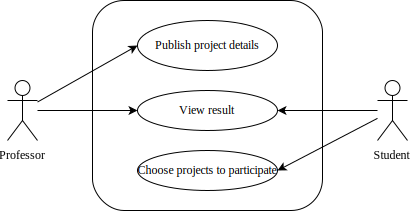

# 项目分析

Piggy-ProjG 是一个网络应用程序，它使教授可以在线发布多个项目，学生可以从中选择他们感兴趣的任何项目。

为了详细说明这一点，教授应该描述这些项目并决定每个项目和每个小组的最大学生人数。并且学生可以选择一个以上自己感兴趣的项目，并按照对这个项目感兴趣（或愿意做）的程度来安排。最后，系统应该将分组结果呈现给教授和学生。

该应用程序应该以网页的形式处理上述所有内容，这意味着用户应该可以通过任何现代浏览器访问该应用程序。

## 用例分析

简单的用例分析如下：

### 发布项目

教授在发布一个项目时，应填写项目名称和项目介绍，并设置项目要求的最高人数和组数、指定项目对小组能力的指标的偏好要求。

### 选择项目

学生在选择项目时，分为“分组”阶段与“选项目”阶段。

“分组”阶段介绍如下：

- “分组”阶段：学生可以首先进行自由组队，学生和教授都可以查看现有的分组情况。每个学生都可以选择创建新的小组、加入现有的小组，或者退出当前所在的小组；教授可以选择向小组中添加学生、或从小组中移除学生。当某组中唯一的成员选择退出小组或被移除时，该小组自动解散。每个小组有人数上限；
- 教授可以选择随时停止“分组”阶段，此时学生无法再进行小组的创建、加入或退出。不符合人数要求的小组（如有）将由教授进行手动调整。调整后的结果视为最终结果。

“选项目”阶段介绍如下：

- 教授确定好分组情况后，小组成员可以按照一定的优先级选择若干自己意向中的项目，称为“填写意愿”。每个成员都可以为小组“填写意愿”，新提交的“意愿”将覆盖旧有的“意愿”；
- 教授可以选择随时停止“选项目”阶段，此时小组无法再对“意愿”进行修改，同时，系统将会根据小组的某种评价指标和“意愿”优先级匹配项目；当某一小组的所有“意愿”均无法被满足时，则随机为其分配某一可选的项目。教授可以修改系统分配后的结果，也可以确定最终结果；该过程中，学生和教授随时都可以查看当前的项目分配情况。

### 账户管理

系统支持用户进行注册。用户可以注册成为“教授”或“学生”。学生可以通过教授提供的“邀请码”加入到教授的课程中。

登录时，用户选择登录身份——“教授”或“学生”。登录成功后，系统将展示对应的页面：

- 教授端：可以查看所教授的课程，以及课程下的各个项目以及分组情况；
- 学生端：可以查看所加入的课程，以及对应课程下可选的项目，以及对应课程中的分组情况。
